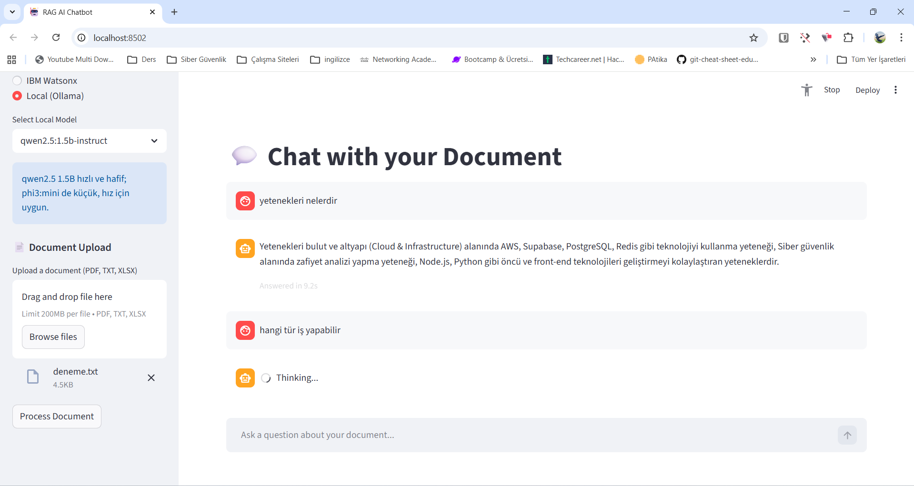

# RAG Documentation Summarizer

Modüler bir RAG uygulaması: PDF/TXT/XLSX dokümanları parçalayıp ChromaDB vektör indeksine yazar, IBM Watsonx **veya** yerel Ollama LLM ile sohbet eder.

## Özellikler
- **Çift mod**: IBM Watsonx (Granite) ya da yerel Ollama (qwen2.5:1.5b-instruct, phi3:mini, llama3.2) seçilebilir.
- **Hız odaklı**: Küçük yerel modeller, düşük `num_predict`, kalıcı Chroma cache (`tmp/chroma/<dosya>`).
- **Çok format**: PDF, TXT, XLSX otomatik tespit ve UTF-8 autodetect ile yükleme.
- **CLI + Web UI**: `main.py` (CLI) ve `app.py` (Streamlit).

## Proje Yapısı
```text
rag/
├── src/
│   ├── config.py            # IBM creds & default model params
│   ├── document_processor.py# yükleme, parçalama, embedding, cache
│   ├── llm_service.py       # Watsonx veya Ollama LLM init
│   └── rag_chain.py         # RAG zinciri, retriever ayarları
├── scripts/
│   ├── setup_local_ollama.py# Docker’da Ollama + modelleri çekme
│   └── smoke_query.py       # Hızlı uçtan uca test
├── app.py                   # Streamlit UI
├── main.py                  # CLI
├── requirements.txt
└── README.md
```

## Kurulum
1) Python 3.11+ ve Docker Desktop (Ollama için).  
2) İsteğe bağlı: modeller ve baz imajlar önce çekilirse ilk run hızlanır:
```powershell
docker pull ollama/ollama:latest
docker pull python:3.11-slim
```

## Docker ile Çalıştırma (Önerilen)
```powershell
docker-compose up --build
```
- Servisler: `ollama` (11434) + `rag` (8501 → host 8502).
- İlk çalıştırmada `qwen2.5:1.5b-instruct` ve `nomic-embed-text` modelleri indirileceği için zaman alabilir.
- IBM anahtarını kullanacaksan, host’ta `.env` oluştur:
```
IBM_CLOUD_API_KEY=...
WATSONX_PROJECT_ID=skills-network
```
`docker-compose` bu değişkenleri `rag` servisine geçirir.

## Yerel (Docker olmadan) Çalıştırma
1) Ollama ve modeller:
```powershell
python scripts\setup_local_ollama.py
```
   - LLM: `qwen2.5:1.5b-instruct` (varsayılan), `phi3:mini`
   - Embed: `nomic-embed-text`

2) `.env` örnek ayarlar (`.env.example`):
```
EMBED_BACKEND=ollama
EMBED_MODEL=nomic-embed-text
OLLAMA_MODEL=qwen2.5:1.5b-instruct
OLLAMA_NUM_CTX=2048
OLLAMA_NUM_PREDICT=96
OLLAMA_TEMPERATURE=0.1
OLLAMA_NUM_PARALLEL=1
OLLAMA_NUM_THREAD=2
```

3) UI:
```powershell
streamlit run app.py
```
Sidebar’da “Local (Ollama)” + `qwen2.5:1.5b-instruct` seç, dokümanı yükle, sorunu sor.

## IBM Watsonx ile Çalıştırma
1) `src/config.py` veya host `.env` içine `IBM_CLOUD_API_KEY` ve `WATSONX_PROJECT_ID` ekle.  
2) UI’da “IBM Watsonx” seç, API anahtarını gir; Granite modeli `DEFAULT_MODEL_ID` ile yüklenir.  
3) Dokümanı yükleyip sorularını sor.

## CLI Hızlı Test
```powershell
python scripts\smoke_query.py
# SMOKE_FILE ve SMOKE_QUESTION env değişkenleriyle özelleştirilebilir
```

## Performans İpuçları
- Daha da hızlı cevap için: `OLLAMA_NUM_PREDICT=64`, retriever `k=2` (src/rag_chain.py).
- Tekrar eden dosyalarda cache: indeks `tmp/chroma/<dosya>` altında tutulur.
- Küçük model seç: qwen2.5:1.5B veya phi3:mini.

## Ekran Görüntüsü


## Bilinen Uyarı
- LangChain `ConversationBufferMemory` deprecation uyarısı işleyişi etkilemez; istenirse yeni memory API’sine taşınabilir.

## Lisans
MIT
